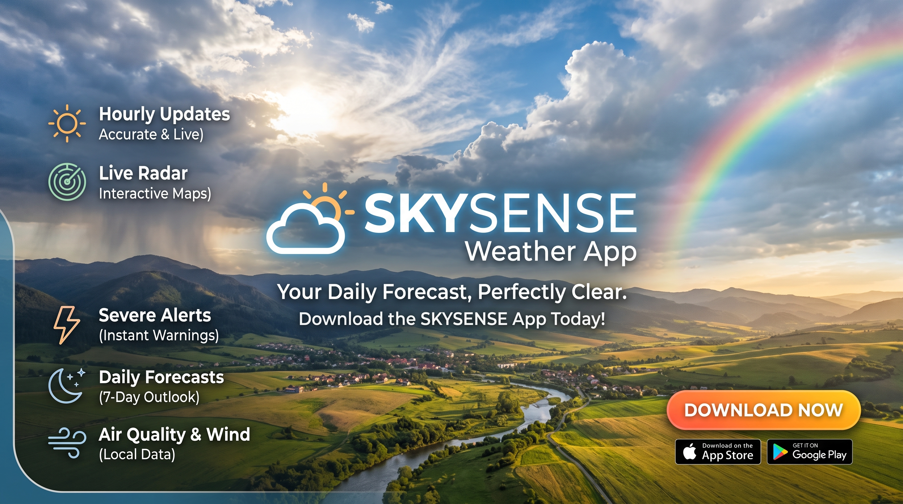
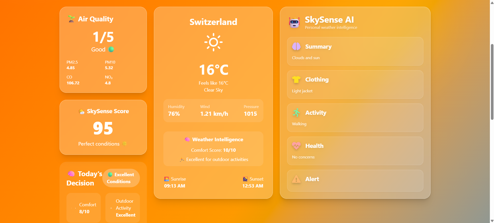
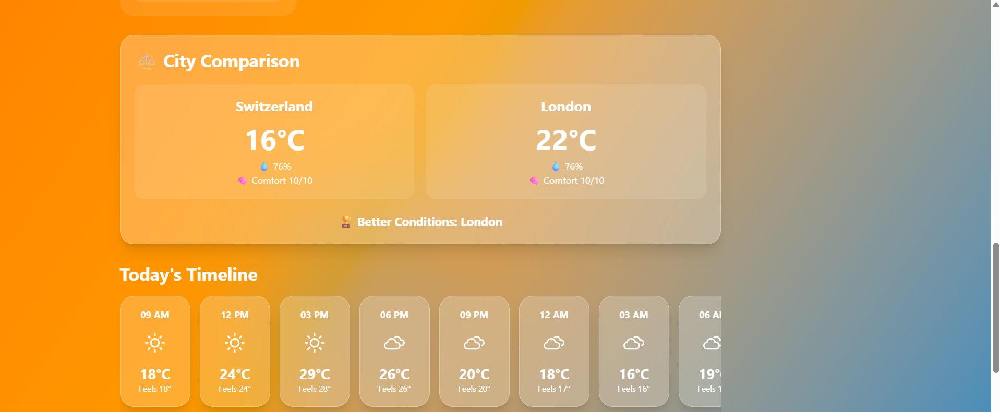

# 🌤 SkySense AI — Intelligent Weather Assistant



## 🚀 Overview

SkySense AI is an AI-powered weather assistant that transforms raw weather data into meaningful decisions.

Instead of only showing temperature and forecasts, SkySense combines:

- 🌦 Real-time weather information
- 🤖 AI-powered recommendations
- 🌱 Air Quality analysis
- ⚖️ City comparison
- 📊 Weather scoring
- 📍 Location-based weather detection

to help users understand what the weather actually means for their daily life.

---

# ✨ Features

## 🌦 Real-Time Weather Dashboard

- Search any city worldwide
- Displays:
  - Temperature
  - Weather conditions
  - Humidity
  - Wind speed
  - Feels-like temperature
  - Sunrise/Sunset information


## 🤖 SkySense AI Assistant

Powered by Groq AI.

Provides personalized recommendations:

- 👕 Clothing suggestions
- 🏃 Activity recommendations
- ❤️ Health advice
- ⚠️ Weather warnings


## 🌱 Air Quality Monitoring

Displays air quality information using AQI data.

Helps users understand:

- Pollution levels
- Outdoor safety
- Health impact


## 🌤 SkySense Score

A custom weather comfort score from 0-100.

Analyzes:

- Temperature
- Humidity
- AQI

and provides an overall weather quality rating.


## ⚖️ City Comparison

Compare two cities based on:

- Temperature
- Humidity
- Comfort score

and find the better weather condition.


## 📍 Location Based Weather

Uses browser geolocation to automatically detect the user's current location.


## 🕒 Forecast System

Includes:

- Hourly forecast
- 5-day forecast


## 🎨 Dynamic Weather Experience

The interface changes based on weather:

- ☀️ Sunny themes
- 🌧 Rain effects
- ☁️ Cloud animations
- 🌙 Night mode


---

# 🛠 Tech Stack

## Frontend

- React.js
- Vite
- Tailwind CSS
- Framer Motion
- React Icons


## APIs

### Weather Data

- WeatherAPI / OpenWeather API


### AI Intelligence

- Groq API


### Air Quality

- Weather Air Quality API


---

# 🏗 Project Structure

```
src
│
├── components
│   ├── WeatherCard.jsx
│   ├── Forecast.jsx
│   ├── HourlyForecast.jsx
│   ├── AIBox.jsx
│   ├── AQI.jsx
│   ├── DecisionPanel.jsx
│   ├── CompareCities.jsx
│   ├── SkyScore.jsx
│   └── WeatherAnimation.jsx
│
├── api.js
├── ai.js
├── App.jsx
└── main.jsx
```

---

# ⚙️ Installation & Setup

Clone the repository:

```bash
git clone https://github.com/Udit007-G/SkySense-Weather-App.git
```

Navigate into the project:

```bash
cd skysense-ai
```

Install dependencies:

```bash
npm install
```

Create a `.env` file:

```env
VITE_WEATHER_API_KEY=your_weather_api_key

VITE_GROQ_API_KEY=your_groq_api_key
```

Start development server:

```bash
npm run dev
```

---

# 🔑 Environment Variables

The project requires:

| Variable | Purpose |
|---|---|
| VITE_WEATHER_API_KEY | Fetch weather and forecast data |
| VITE_GROQ_API_KEY | Generate AI recommendations |

---


# 📸 Screenshots

## Main Dashboard


## AI Weather Assistant




## City Comparison



---

# 🔮 Future Improvements

Possible future upgrades:

- 🎙 Voice-based weather assistant
- 🌍 Weather alerts
- 📱 Mobile application
- 📈 Historical weather analysis
- 🧠 More advanced AI personalization
- 🌐 Multi-language support


---

# 👨‍💻 Author

Built with ❤️ for hackathon submission.

---

# 📄 License

This project is open-source and available under the MIT License.